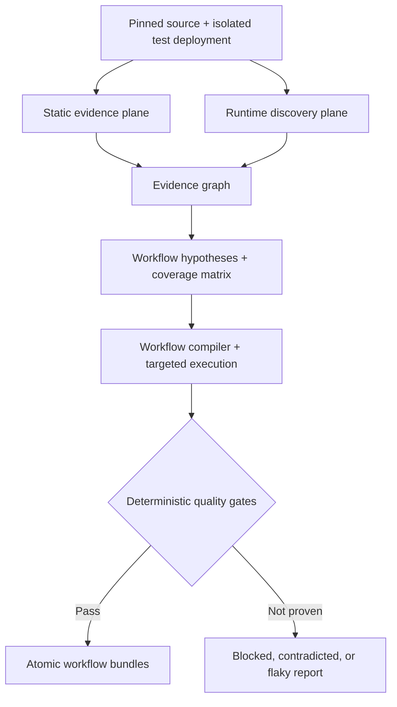

# ADR-001: Arxic — Evidence-Driven Behavioral Intent Compiler for Playwright

| Field                     | Value                                                                                                                                       |
| ------------------------- | ------------------------------------------------------------------------------------------------------------------------------------------- |
| Status                    | Accepted (2026-08-04)                                                                                                                       |
| Decision date             | 2026-08-04                                                                                                                                  |
| Owners                    | Arxic maintainers                                                                                                                           |
| Scope                     | Initial architecture, reuse strategy, contracts, security model, and authentication vertical slice                                          |
| First supported ecosystem | TypeScript and JavaScript; React, Next.js, Express; Chromium                                                                                |
| Primary output            | Independently replayable Playwright workflow bundles with screenshots, privacy-preserving action timelines, provenance, and coverage status |
| Research basis            | Public project and documentation review summarized in an internal source ledger                                                             |

## 1. Decision

Arxic is a hybrid, evidence-driven compiler (not a pure source crawler and not a free-form browser agent).

Arxic assembles proven capabilities from public seams and keeps only product glue:

1. deterministic repo scanning + structural extraction
2. framework structural (AST) rules
3. bounded breadth discovery (queue + sessions)
4. browser execution + planning/generation/healing
5. durable workflow orchestration
6. in-memory evidence graph
7. strict JSON-Schema validation
8. isolated test dependencies
9. captured-mail sink + test-token generation

It owns evidence contracts, confidence states, coverage logic, safety policy, compiler/promotion gates, incremental invalidation, and licensing provenance. It is not a wholesale fork.

## 2. Blunt feasibility finding

No tool can reliably recover full business intent from source alone.

Arxic uses five truth states:

| State        | Meaning                                                                                 | Who may assign it           |
| ------------ | --------------------------------------------------------------------------------------- | --------------------------- |
| hypothesized | Suggested by source, docs, or a model, but not observed at runtime                      | Static analyzers or model   |
| observed     | A runtime surface/action was seen, but outcome not fully proved                         | Runtime collector           |
| verified     | Preconditions, actions, assertions, and transitions passed in replayable Playwright run | Deterministic verifier only |
| contradicted | Runtime evidence disproved candidate or source evidence conflicts                       | Reconciler/verifier         |
| blocked      | Verification blocked by missing fixture/account/flag/environment/approval               | Orchestrator/verifier       |

An LLM may create or refine hypotheses. It may never assign verified.

“Complete” is explicit by scope matrix: repository, commit, deployment, personas, flags, browser, route, and allowed action. Uncovered and blocked states are reported; Arxic never treats a pass as full coverage.

## 3. Context and problem

Users point Arxic at a repo and safe deployment, receive small Playwright bundles, inspect evidence-backed actions, replay, then review deterministic gaps.

The existing ecosystem splits across: source-only knowledge tools, diagram workflow tools, and browser agents. None provides the full evidence-to-verified-workflow chain, so Arxic composes them at capability seams.

## 4. Decision drivers

1. Evidence and reproducibility over plausible output.
2. Reuse proven capability layers.
3. Public seams over private internals.
4. Small replaceable adapters.
5. Safe execution for hostile input.
6. Explicit blocked/uncovered reporting.
7. Incremental re-run behavior.
8. Traceable licensing.
9. Human-readable plans and machine-readable contracts.
10. Narrow, demonstrable first slice.

## 5. Scope

### 5.1 In scope

- local CLI and isolated worker
- one repository at pinned commit
- TypeScript/JavaScript with React, Next.js, Express
- Chromium execution
- local/preview/dedicated test targets
- authentication reference domain
- static evidence, targeted execution, verification, screenshots/sanitized action timelines, bundle packaging
- incremental invalidation by graph impact

### 5.2 Non-goals

- default production execution
- proving absent requirements
- fully autonomous destructive workflows
- replacing security/product QA
- all-language framework support
- private runtime internals as stable API
- screenshot-only inference
- one mutable mega-suite

## 6. Capability assembly ledger

Arxic assembles capabilities from established open-source engines via public APIs/process boundaries only. Capability areas include structural extraction, framework rules, bounded discovery, browser planning/execution/healing, durable orchestration, evidence graphing, strict schema validation, and isolated dependencies (disposable services, captured mail, test tokens). Engine names, exact pins, and reviewed seams remain internal, governed by adapter contracts (§10.5).

### 6.1 Evaluated but not selected

| Category                            | Finding                                       | Decision             |
| ----------------------------------- | --------------------------------------------- | -------------------- |
| diagram-oriented workflow schemas   | Useful for representation, not behavior proof | Not primary          |
| model-derived domain inference      | Useful hypothesis only                        | Keep hypothesis-only |
| alternative agentic browser stacks  | Adds control-plane overlap                    | Defer                |
| copyleft test tooling               | Legal/compliance risk                         | Rejected             |
| alternative code-indexing protocols | Value not proven in first slice               | Defer                |
| state-machine libraries             | Already satisfied by orchestration seam       | Defer                |
| alternative browser runtimes        | Duplicate browser control plane               | Defer                |
| regex-only discovery                | Too brittle                                   | Fallback only        |

## 7. Reuse boundaries

### 7.1 Source and extraction seam

Structure extraction provides deterministic inventory, language detection, and evidence extraction. It is evidence-first, not proof-first.

### 7.2 Validation seam

Validation enforces contracts, stable diagnostics, immutable staging, hash receipts, atomic promotion, and preserved last-known-good. No verified status without evidence and policy compliance.

### 7.3 Browser seam

Public tooling surfaces supply fixtures/projects/reports. Planner/generator/verifier/healer are adapter-based and policy constrained.

### 7.4 Discovery seam

Discovery maps safe route/control surfaces and prioritizes budgeted sessions. It does not treat presence as truth.

- Allowed: index routes/controls, record navigation, prioritize queues, honor origin budgets, retry transient failures.
- Prohibited: destructive submits without policy, inferred transitions from presence, unsafe shared mutation, origin escape, unbounded frontier.

## 8. System architecture



```mermaid
flowchart TD
  subgraph INPUTS["1. Inputs"]
    SRC["Pinned source repository"]
    CFG["Arxic scope and policy"]
    TARGET["Local/test/preview deployment"]
    MODEL["User-selected LLM endpoint"]
  end
  MODEL --> MAD["ModelAdapter"]
  subgraph ORCH["Durable orchestration"]
    direction TB
    subgraph PREFLIGHT["2. Preflight and isolation"]
      REV["Resolve commit and manifest"]
      ATTEST["Validate target, environment, origins, action policy"]
      SAFE{"Target approved and reachable?"}
      STOP["Stop with blocking diagnostics"]
      WORKER["Create ephemeral worker + isolated network"]
      REV --> ATTEST --> SAFE
      SAFE -- No --> STOP
      SAFE -- Yes --> WORKER
    end
    subgraph STATIC["3. Static evidence plane"]
      direction TB
      SCAN["Scanner + structural extraction"]
      RULES["Framework structural rules"]
      DOCS["Parse docs/manifests/tests"]
      SEVENTS["Normalize source evidence"]
      GRAPH["In-memory evidence graph"]
      NEIGHBOR["Build bounded evidence neighborhoods"]
      INFER["LLM infers candidates"]
      HYP["Hypothesized workflows"]
      SCAN --> SEVENTS --> GRAPH --> NEIGHBOR --> INFER --> HYP
      RULES --> SEVENTS
      DOCS --> SEVENTS
    end
    subgraph BREADTH["4. Runtime breadth discovery"]
      direction TB
      BOOT["Start app via EnvironmentAdapter"]
      DEPS["Provision disposable services + captured mail + token"]
      CRAWL["Breadth crawler"]
      SURFACES["Collect routes, controls, navigation, network"]
      OBS["Observed surfaces"]
      BOOT --> DEPS --> CRAWL --> SURFACES --> OBS
    end
    subgraph RECON["5. Reconciliation"]
      direction TB
      MERGE["Reconcile static + runtime evidence"]
      MATRIX["Coverage matrix"]
      SELECT{"In-scope candidate available?"}
      PRECOND{"Safe preconditions available?"}
      BLOCKED["Mark blocked reason"]
      LEASE["Lease disposable fixture"]
      DISPOSITION["Record blocked/contradicted/flaky/uncovered"]
      MERGE --> MATRIX --> SELECT
      SELECT -- Yes --> PRECOND
      SELECT -- No --> DISPOSITION
      PRECOND -- Yes --> LEASE
      PRECOND -- No --> BLOCKED --> DISPOSITION
    end
    subgraph TARGETED["6. Targeted exploration"]
      direction TB
      PLAN["Planner builds intent"]
      ACTION["Policy checks action class"]
      AUTHZ{"Action decision"}
      HUMAN["Human approval if needed"]
      EXPLORE["Browser executes and journals"]
      TEVID["Capture runtime evidence"]
      COMPLETE{"Required transitions observed?"}
      BUDGET{"Exploration budget remains?"]
      WIR["Normalize Workflow IR"]
      GENERATE["Compile workflow"]
      STAGE["Stage outputs"]
      LEASE --> PLAN --> ACTION
      ACTION -- Read-only or leased mutation --> EXPLORE
      ACTION -- Approval required --> HUMAN
      ACTION -- Forbidden --> BLOCKED
      HUMAN -- Approved --> EXPLORE
      HUMAN -- Denied --> BLOCKED
      EXPLORE --> TEVID --> COMPLETE
      COMPLETE -- Yes --> WIR --> GENERATE --> STAGE
      COMPLETE -- No --> BUDGET
      BUDGET -- Yes --> PLAN
      BUDGET -- No --> BLOCKED --> DISPOSITION
    end
    subgraph VERIFY["7. Deterministic compilation and verification"]
      direction TB
      SCHEMA["Schema + TypeScript check"]
      CPASS{"Schema pass?"}
      POLICY["Secret/origin/assertion policy"]
      PPASS{"Policy pass?"}
      REPLAY["Run clean fixtures"]
      ARTIFACTS["Capture screenshots/sanitized timelines/reports"]
      EXPECTED{"Expected transitions pass?"]
      RUNCOUNT{"Required clean runs complete?"]
      RESET["Reset and retry"]
      FAILURE{"Failure category"}
      HEALBUDGET{"Heal budget remains?"]
      HEAL["Propose mechanical repair"]
      PRESERVE{"Intent preserved?"]
      REJECT["Reject and remain unverified"]
      CONTRADICTED["Mark contradicted"]
      FLAKY["Mark flaky"]
      VERIFIED["Mark verified"]
      STAGE --> SCHEMA --> CPASS
      CPASS -- No --> BLOCKED
      CPASS -- Yes --> POLICY --> PPASS
      PPASS -- No --> REJECT --> DISPOSITION
      PPASS -- Yes --> REPLAY --> ARTIFACTS --> EXPECTED
      EXPECTED -- Yes --> RUNCOUNT
      RUNCOUNT -- No --> RESET --> REPLAY
      RUNCOUNT -- Yes --> VERIFIED
      EXPECTED -- No --> FAILURE
      FAILURE -->|mechanical drift| HEALBUDGET
      FAILURE -->|runtime contradiction| CONTRADICTED
      FAILURE -->|missing fixture| BLOCKED
      FAILURE -->|nondeterministic| FLAKY
      HEALBUDGET -- No --> REJECT
      HEALBUDGET -- Yes --> HEAL --> PRESERVE
      PRESERVE -- No --> REJECT
      PRESERVE -- Yes --> STAGE
      CONTRADICTED --> DISPOSITION
      FLAKY --> DISPOSITION
      REJECT --> DISPOSITION
    end
    subgraph PROMOTION["8. Evidence gates and atomic publication"]
      direction TB
      EVIDGATE["Check evidence completeness"]
      EVIDPASS{"Evidence complete?"}
      FREEZE["Freeze staged bundle bytes"]
      META["Compute hashes + provenance"]
      PROMOTE["Atomically promote"]
      BUNDLE["Verified bundle"]
      COVERAGE["Coverage and blocker report"]
      DOMAINPACK["Consumable domain pack"]
      VERIFIED --> EVIDGATE --> EVIDPASS
      EVIDPASS -- No --> BLOCKED --> DISPOSITION
      EVIDPASS -- Yes --> FREEZE --> META --> PROMOTE --> BUNDLE --> DOMAINPACK
      DISPOSITION --> COVERAGE --> DOMAINPACK
    end
  end

  SRC --> REV
  CFG --> ATTEST
  TARGET --> ATTEST
  REV --> SCAN
  REV --> RULES
  REV --> DOCS
  WORKER --> BOOT
  MAD --> INFER
  MAD --> PLAN
  MAD --> GENERATE
  MAD --> HEAL
  HYP --> MERGE
  GRAPH --> MERGE
  OBS --> MERGE
  TEVID --> GRAPH

  subgraph INCREMENTAL["9. Incremental reruns"]
    NEW["New commit/build/flags"]
    IMPACT["Compute impact graph"]
    INVALIDATE["Invalidate affected artifacts"]
    REUSE["Reuse unaffected deterministic outputs"]
    NEW --> IMPACT --> INVALIDATE
    IMPACT --> REUSE
    INVALIDATE --> REV
  end
  DOMAINPACK --> CACHE["Content-addressed artifact cache"]
  CACHE --> IMPACT
```

### 8.1 Control plane

Orchestration persists checkpoints per stage and passes immutable artifact references through stages.

### 8.2 Static evidence plane

Deterministic sequence: resolve commit, inventory and hash, extract structure, apply rules, ingest docs/tests, normalize evidence, build graph, create bounded neighborhoods, then propose candidates.

### 8.3 Runtime discovery plane

Breadth mode finds safe inventory; targeted mode executes one candidate with fixtures and expected transitions.

### 8.4 Evidence and coverage plane

The in-memory graph stores source/runtime nodes/edges with evidence references for any node influencing output.

### 8.5 Compilation and verification plane

The compiler emits plan, fixtures, independent specs, checkpoint metadata, and assertions. Staged outputs are consumed only after deterministic gates pass.

## 9. Pipeline

| Stage | Borrowed capability     | Arxic input               | Output                       | Failure behavior                |
| ----- | ----------------------- | ------------------------- | ---------------------------- | ------------------------------- |
| 0     | Target attestation      | Source, target, policy    | Environment receipt          | Stop unapproved targets         |
| 1     | Deterministic scanning  | Checkout                  | Manifest, hashes, languages  | Unsupported language gap        |
| 2     | Structural extraction   | Changed files             | Symbols/imports/calls/routes | Keep parse diagnostics          |
| 3     | Framework rules         | Versioned rule packs      | Auth/form/route evidence     | Labeled low-confidence fallback |
| 4     | Inference orchestration | Bounded neighborhoods     | Hypothesized candidates      | Structured-output retries       |
| 5     | Bounded discovery       | URLs, budgets, personas   | Surface map                  | Frontier/origin stops           |
| 6     | Reconciliation          | Static + runtime evidence | Coverage matrix              | Contradictions -> contradicted  |
| 7     | Fixture prep            | Preconditions             | Disposable fixtures/services | Missing requirements blocks     |
| 8     | Targeted exploration    | Candidate + allowlist     | Runtime evidence + snapshots | Unsafe actions blocked          |
| 9     | Workflow compiler       | Workflow + observations   | Staged plan/spec             | Unsupported steps dropped       |
| 10    | Verification            | Staged bundle             | Artifacts and evidence       | Classified failures             |
| 11    | Healing                 | Failure + evidence        | Repair patch                 | Weakening is rejected           |
| 12    | Promotion               | Staged bundle             | Atomic verified bundle       | Last-good preserved             |

## 10. Canonical contracts

### 10.1 Source revision

```json
{
  "repository": "https://github.com/example/shop",
  "commit": "40-character-full-sha",
  "dirty": false,
  "submodules": [
    {
      "path": "packages/idp",
      "repository": "https://github.com/example/idp",
      "commit": "40-character-full-sha"
    }
  ]
}
```

### 10.2 Evidence reference

```ts
type EvidenceRef =
  | {
      kind: 'source';
      repo: string;
      commit: string;
      path: string;
      startLine: number;
      endLine: number;
      blobSha256: string;
      extractor: string;
      ruleId?: string;
    }
  | {
      kind: 'runtime';
      runId: string;
      appBuildDigest: string;
      browser: string;
      browserVersion: string;
      url: string;
      timestamp: string;
      accessibilitySnapshotSha256?: string;
      screenshotRef?: string;
      traceRef?: string;
      networkRefs?: string[];
    }
  | { kind: 'document'; artifactRef: string; section?: string; sha256: string };
```

### 10.3 Workflow IR

```json
{
  "$schema": "https://arxic.dev/schemas/workflow/v1.json",
  "id": "auth.password-reset.request",
  "version": 1,
  "title": "Request a password reset",
  "domain": "authentication",
  "persona": "registered-user",
  "status": "verified",
  "confidence": 1.0,
  "scope": {
    "commit": "40-character-full-sha",
    "environment": "local-test",
    "browser": "chromium",
    "featureFlags": ["password-reset=true"]
  },
  "preconditions": [
    { "fixture": "user.exists", "parameters": { "emailRef": "persona.email" } },
    { "fixture": "mailbox.empty", "parameters": { "inboxRef": "persona.inbox" } }
  ],
  "states": [
    { "id": "login-page" },
    { "id": "reset-request-form" },
    { "id": "reset-request-accepted" },
    { "id": "reset-email-received" }
  ],
  "transitions": [
    {
      "from": "login-page",
      "to": "reset-request-form",
      "action": { "intent": "Open the forgot-password form" },
      "assertions": [{ "intent": "Reset request form is available" }],
      "evidenceRefs": ["src:forgot-link", "run:forgot-link"]
    },
    {
      "from": "reset-request-form",
      "to": "reset-request-accepted",
      "action": {
        "intent": "Submit the registered email",
        "inputRefs": { "email": "persona.email" }
      },
      "assertions": [{ "intent": "A non-enumerating acceptance message is shown" }],
      "evidenceRefs": ["src:reset-handler", "run:reset-submit"]
    },
    {
      "from": "reset-request-accepted",
      "to": "reset-email-received",
      "action": { "intent": "Read the test inbox through InboxAdapter" },
      "assertions": [{ "intent": "Exactly one valid reset message arrives" }],
      "evidenceRefs": ["src:mailer", "run:inbox-message"]
    }
  ],
  "negativeCases": [
    { "id": "unknown-email", "expected": "The response does not disclose account existence" }
  ],
  "verification": {
    "requiredRuns": 2,
    "screenshotCheckpoints": ["reset-request-form", "reset-request-accepted"],
    "trace": "retain",
    "forbidNetworkErrors": true
  },
  "evidenceRefs": [
    "src:forgot-link",
    "src:reset-handler",
    "src:mailer",
    "run:forgot-link",
    "run:reset-submit",
    "run:inbox-message"
  ]
}
```

Rules: intent text is stable; each transition has action/event + assertions; each claim has evidence or explicit proposal state; no verified status for hypothetical transitions; scope includes flags, build, browser, persona.

### 10.4 Diagnostics

```json
{
  "code": "ARXIC-RUNTIME-004",
  "severity": "blocked",
  "subject": "auth.mfa.enroll",
  "message": "No safe test fixture can provision an MFA-capable user.",
  "evidenceRefs": ["src:mfa-controller", "config:idp-provider"],
  "supportedFixes": ["Configure PersonaProvisioner", "Provide a disposable seeded account"]
}
```

### 10.5 Adapter contracts

```ts
interface SourceIndexer {
  index(input: SourceIndexRequest): AsyncIterable<EvidenceEvent>;
}
interface SurfaceDiscoverer {
  discover(input: DiscoveryRequest): AsyncIterable<EvidenceEvent>;
}
interface FixtureProvider {
  supports(requirement: FixtureRequirement): boolean;
  provision(requirement: FixtureRequirement): Promise<FixtureLease>;
  reset(lease: FixtureLease): Promise<void>;
  release(lease: FixtureLease): Promise<void>;
}
interface WorkflowPlanner {
  plan(candidate: WorkflowCandidate, context: RuntimeContext): Promise<PlanResult>;
}
interface WorkflowCompiler {
  compile(workflow: Workflow, observations: EvidenceRef[]): Promise<StagedBundle>;
}
interface WorkflowVerifier {
  verify(bundle: StagedBundle, policy: VerificationPolicy): Promise<VerificationResult>;
}
interface BundlePromoter {
  promote(bundle: StagedBundle, gates: GateResult[]): Promise<PromotionReceipt>;
}
```

Adapters return contracts, not implementation-specific objects.

## 11. Coverage model

Coverage is by matrix dimensions: revision/build, domain, persona, route, precondition, path type, verification status, and blocker reason. Typical measures: candidate accountability, verified-transition rate, source-evidence overlap, runtime-evidence overlap.

## 12. Authentication vertical slice

Authentication is a domain pack of independent Playwright bundles.

### 12.1 Candidate inventory

login, invalid login, logout, forgot/reset request, password change, MFA flows, session expiry/reauth, role/tenant auth paths.

### 12.2 Static evidence examples

Routes, forms, validation, handlers, middleware/guards, token/session handling, mail transport, OTP/recovery, fixtures, feature flags.

### 12.3 Runtime fixtures

| Need        | Adapter                                   | Rule                     |
| ----------- | ----------------------------------------- | ------------------------ |
| users       | PersonaProvisioner                        | Use app seed path only   |
| inbox       | InboxAdapter backed by captured-mail-sink | Isolated network only    |
| tokens      | OtpAdapter backed by test-otp             | Secrets never logged     |
| hosted auth | IdentityProviderAdapter                   | Dedicated test tenant    |
| flags       | FeatureFlagAdapter                        | Snapshot recorded        |
| timing      | ClockAdapter where supported              | Wait-free where possible |

### 12.4 Emitted domain pack

```text
authentication/
  domain-manifest.json
  coverage-matrix.json
  login-success/
  password-reset-request/
  password-change/
  mfa-enrollment/
  mfa-challenge/
  logout/
```

Hypothesized/contradicted/blocked candidates remain in coverage reporting with evidence.

## 13. Playwright compilation rules

1. Prefer semantic locators.
2. CSS/XPath only with rationale.
3. User-visible outcomes only.
4. No `waitForTimeout`.
5. No arbitrary load-state substitution.
6. Minimal `page.evaluate`.
7. No secrets or real personal data.
8. Lease-scoped state mutation only.
9. Checkpointed screenshots and sanitized action timelines with adjacent provenance; raw Playwright traces are never retained.
10. Independent tests and clean fixture reset.

### 13.1 Healing policy

Allowed: locator swaps, deterministic readiness fixes, evidence-aligned route updates.

Forbidden: skip/fixme/only, assertion weakening, changed business outcomes, force-click escalation, unsafe cross-origin behavior.

Every allowed heal produces a semantic diff and requires policy approval.

## 14. Bundle contract

```text
arxic-bundle/
  manifest.json
  workflow.json
  plan.md
  tests/workflow.spec.ts
  fixtures/workflow.fixture.ts
  evidence/{index,source,runtime}.json
  artifacts/{screenshots,traces,reports}/
  provenance.json
  NOTICE
  sbom.cdx.json
  checksums.sha256
```

Manifest includes scope, versions, provenance, verification results, gate outcomes, blockers, and hashes.

## 15. Quality gates

| Gate            | Requirement                                                                                                            |
| --------------- | ---------------------------------------------------------------------------------------------------------------------- |
| Schema          | All JSON valid in strict mode                                                                                          |
| Provenance      | Links resolve to pinned commit/range                                                                                   |
| Compilation     | TypeScript compiles and generated suite is discoverable                                                                |
| Policy          | No forbidden directives, APIs, origins, or secrets                                                                     |
| Fixtures        | Provision/reset/release succeeds                                                                                       |
| Execution       | Required runs pass from clean state                                                                                    |
| Evidence        | Required transitions are evidenced                                                                                     |
| Artifact        | Screenshots and sanitized action timelines have hashes; every timeline has independently validated adjacent provenance |
| Network/console | Unexpected failures block promotion                                                                                    |
| Coverage        | Disposition and blocker matrix present                                                                                 |
| Delivery        | Frozen bytes and atomic promotion                                                                                      |

One pass plus one failure is flaky, not verified.

## 16. Security architecture

### 16.1 Isolation

- ephemeral non-root workers
- read-only source with scoped writes
- strict egress and quotas
- deterministic cleanup
- untrusted runtime never controls container infrastructure

### 16.2 Test-target attestation

Default denies production-like targets. Requires allowed origin, environment class, build digest, action policy, and explicit handshake. Overrides require recorded human approval.

### 16.3 Prompt injection

Model outputs are data, not policy. Agents get fixed task scope, tool allowlist, origin constraints, no shell, no broad filesystem access, and validated structured output.

### 16.4 Action classes

- read-only
- reversible mutation with leased fixtures
- external side effect requires dedicated policy
- destructive/privileged requires human approval

### 16.5 Secrets and privacy

Use references, inject at the last boundary, and keep test content in non-production sinks. Raw Playwright traces are never retained: a shared fail-closed boundary requires at least one exact Chromium context per archive and projects the input into deterministic, privacy-preserving action timelines containing only fixed context and known completed action metadata. The pinned neutral test-runner member remains neutral and cannot establish the Chromium requirement; other or missing browser identities are rejected rather than relabeled. The projection omits network/DOM/frame snapshots, resources and screencasts, stacks/sources, attachments, logs/stdio, errors/results, free-form params, source identifiers, and source-derived names. Each retained timeline requires adjacent checksum/projection provenance and independent canonical-byte inspection before assembly or promotion. A sanitized timeline is action-order evidence, not replay-, DOM-, screenshot-, source-, or network-complete evidence. Screenshot privacy is enforced separately at capture and visual-review boundaries.

## 17. Incremental operation

Cache keys include revision, extractor/version, environment/build, persona, and schema/prompt controls. Structural/runtime changes invalidate impacted evidence and candidates; reusable outputs are preserved with run provenance.

## 18. Repository layout

```text
arxic/
  apps/{cli,worker}
  packages/{contracts,orchestrator,source-indexer-adapter,rulepack-adapter,crawler-adapter,browser-automation-adapter,compiler,evidence-graph,reconciler,verifier,playwright-trace-sanitizer,bundle-promoter,environment,fixture-adapters}
  rulepacks/{nextjs,react,express}
  schemas/{evidence,workflow,manifest,diagnostics}
  third_party/{reused-capabilities}
  test-fixtures/{vulnerable-auth-app,reference-auth-app}
  docs/{adr,threat-model}
  LICENSES/ NOTICE
```

third_party stores reviewed reused code and attribution records; no engine internals are imported as stable runtime APIs.

## 19. Configuration

```yaml
version: 1
source:
  repository: .
  revision: HEAD
  languages: [typescript, javascript]
scope:
  domains: [authentication]
  frameworks: [nextjs, react, express]
  browsers: [chromium]
  personas: [anonymous, registered-user]
  featureFlags: { password-reset: true, mfa: true }
target:
  origin: http://app.arxic.test
  environmentClass: local-test
  attestationPath: /.well-known/arxic-test-target.json
  allowedOrigins:
    - http://app.arxic.test
    - http://mail-sink.arxic.test
policy:
  maxUrls: 250
  maxDepth: 8
  maxRuntimeMinutes: 30
  mutation: leased-fixtures-only
  externalNetwork: deny
  requiredVerificationRuns: 2
  screenshots: transition-checkpoints
  trace: retain
  humanApproval: [destructive, external-side-effect]
fixtures:
  inbox: captured-mail-sink
  otp: test-otp
  personaProvisioner: app-seed-api
models:
  provider: configured-adapter
  sourceRetention: disabled
```

## 20. Operational model

Start as local CLI + ephemeral workers; services can reuse the same worker protocol later.

### 20.1 Observability

Track stage checkpoints, artifact hashes, tool/version matrix, approval decisions, gate outcomes, redaction actions, and run IDs.

## 21. Non-functional targets

- deterministic static output for pinned inputs
- resumability across stage failures
- strict isolation between runs
- last-known-good protection
- inspectability of every claim to evidence
- adapter swap compatibility
- enforced budgets
- meaningful incremental behavior

## 22. Implementation milestones

- M0: contract freeze, threat model, parser proof, atomic promotion.
- M1: authentication slice with login/logout/reset/password change/TOTP and captured mail sink.
- M2: healing clustering, hosted identity, multi-framework hardening.
- M3: service mode after worker contracts stabilize.

## 23. Acceptance criteria

1. Deterministic manifest and evidence graph.
2. Evidence-linked or explicit unsupported candidates.
3. Source-only findings stay hypothesized.
4. Runtime-only findings stay observed.
5. Verified auth workflows are independent bundles.
6. Password-reset uses real inbox evidence.
7. TOTP/recovery uses real test fixture behavior.
8. Suites pass twice from clean fixtures.
9. Required artifacts are hash-verified.
10. Gates reject secrets, unsafe origins, and unsafe directives.
11. Missing behaviors appear as blocked.
12. Failed runs preserve prior promoted bundle.
13. Output includes licenses, provenance, versions, and SBOM.
14. Major upgrades pass adapter-contract suites.

## 24. Risks and mitigations

| Risk                                     | Consequence           | Mitigation                                 |
| ---------------------------------------- | --------------------- | ------------------------------------------ |
| scope exceeds observable evidence        | False confidence      | Truth matrix + blocked/uncovered reporting |
| capability seam drift                    | Fragile behavior      | Maturity checks + replacement plan         |
| browser-agent seam changes               | Generation breakage   | Contracts, pinning, compatibility tests    |
| structural extraction misses conventions | Candidate gaps        | rule-packs + runtime reconciliation        |
| LLM hallucination                        | Invalid candidates    | Evidence-only final proof                  |
| prompt injection                         | Unsafe policy changes | fixed policy and allowlists                |
| shared-state mutation                    | Flaky/corrupted runs  | bounded fixtures and serialized mutations  |
| healing over-correction                  | False passes          | semantic diffs and status checks           |
| external side channels                   | PII leakage           | isolated sinks + fixture policy            |
| license-risk code import                 | Compliance issue      | strict license gates                       |

## 25. Consequences

### Positive

- clearer differentiator through evidence and verification
- independent upgrade/replacement paths
- explicit distinction of verified vs inferred behavior

### Negative

- requires safe test infrastructure and fixture adapters
- slower and more costly than source-only generation
- browser-agent seam must remain compatible

### Accepted trade-off

Trustworthy partial coverage is preferred over optimistic claims.

## 26. Decisions intentionally deferred

- model-provider and retention policy
- whether scanner fragments should be contributed upstream
- hosted identity providers supported first
- signing scheme beyond current checksums
- vision observer and precision adapters
- multi-tenancy and mobile/native support

Default: local CLI, no source retention in model requests, Chromium, and isolated first-party test environments.

## 27. Source ledger

The specific upstream engines, pinned commits, file seams, and license records are tracked internally and deliberately not published. Arxic consumes each via public APIs or process boundaries behind adapter contracts (§10.5); no upstream internals are imported.

## 28. Final architectural rule

Borrow capabilities. Vendor only small reviewed seams. Keep every upstream behind an adapter. Preserve licenses and compatibility records. Let models propose. Let runtime observe. Let deterministic gates verify. Publish only atomic, evidence-backed Playwright workflow bundles.
