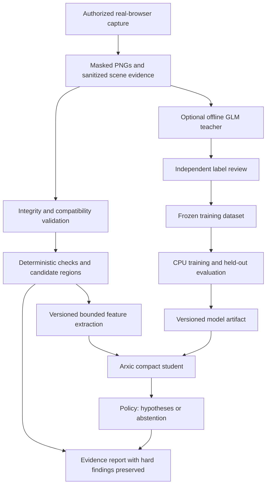

# Arxic compact visual reviewer — specification v0.1

Status: **implementation specification with an experimental subset now built; Codex builds the foundation before any GLM handoff**. Date: 2026-09-06.
Tracker: [#423](https://github.com/anthonykewl20/arxic/issues/423), related product work [#402](https://github.com/anthonykewl20/arxic/issues/402).
This defines the full target; the experimental implementation below is not a deployment claim, accepted ADR, or replacement for the [full visual-auditor contract](./visual-oracle.md).

## 1. Objective and authority

Build an Arxic-owned, narrowly trained model that helps classify frontend visual changes using bounded image features and browser measurements. Train the first model on a normal CPU without renting GPUs. Run inference without a frontier-model API, Python ML framework, language decoder, or GPU on the target analysis VPS.

The owner supplied this machine envelope: **512 MiB RAM, 1 vCPU, 10 GiB SSD, 500 GiB monthly transfer**. No hourly/monthly price or teacher budget was supplied. These are constraints, not evidence that the design fits. Zero overhead and zero training cost are not achievable: CPU time, memory, storage, teacher usage and label review must be accounted for.

“Our own architecture” means Arxic owns the feature contract, student topology, weights, training recipe, evaluation data and decision policy. It does not require inventing a new neural-network primitive, image decoder, cryptographic algorithm or numerical library. Mature licensed components remain allowed. No novelty or patent claim is made.

Normative words: **MUST** is an acceptance requirement; **SHOULD** permits a documented deviation; **MAY** is optional. All numerical performance and quality thresholds below are proposed requirements, not measured results. Any relaxation must be explicit in the issue, PR and new spec version.

User instructions control scope. Repository implementation follows [engineering-charter.md](./engineering-charter.md) and [ADR-001](./adr/001-arxic-architecture.md). Models may propose hypotheses; only Arxic's independent deterministic verifier can assign `verified`. A model score, agreement between models, or empty findings cannot do so.

## 2. Deliverables and exclusions

The eventual implementation delivers:

1. Versioned evidence, feature, training-label and prediction contracts.
2. Deterministic candidate extraction and a no-learning baseline.
3. A small CPU trainer, reproducible model artifact and minimal native inference executable.
4. Optional offline GLM teacher-label generation with budget enforcement and independent label review.
5. An evaluation harness reporting quality, abstention, coverage, cost and resource use.
6. Shadow integration into Arxic, preserving existing findings and gate outcomes.
7. A model card, safe evidence bundle, deployment instructions and rollback procedure.

The first release does **not** claim general screenshot understanding, aesthetic judgment, full UX evaluation, arbitrary language understanding, OCR, autonomous browsing, code repair, video understanding, full accessibility certification, or the entire visual-oracle taxonomy. It cannot infer a user's intent from pixels. Business behavior still needs executed workflows; UX effectiveness needs task evidence and human evaluation.

A handcrafted rule is preferable when it directly expresses an independent requirement. The student must add measurable value beyond those rules. If it does not, the valid outcome is to keep the deterministic baseline and report that learning was unnecessary or unsuccessful.

## 3. Deployment boundary and outstanding decisions

The owner has not yet specified whether 512 MiB covers analysis alone or the full Arxic stack including Chromium. This spec proceeds with two explicit profiles; it does not silently assume an additional paid machine.

| Profile               | Contents of the 512 MiB VPS                                                        | Capture location                                                                            | Acceptance status                                                                               |
| --------------------- | ---------------------------------------------------------------------------------- | ------------------------------------------------------------------------------------------- | ----------------------------------------------------------------------------------------------- |
| A: analysis service   | Minimal authenticated intake, one native analysis process, bounded local artifacts | An existing developer machine or CI runner executes Chromium and exports permitted evidence | Primary feasibility target; owner confirmation needed before deployment                         |
| B: all on one machine | Arxic server, Chromium, tested-app dependencies where applicable, analysis and OS  | Same VPS                                                                                    | Unproven; requires an independent full-stack resource campaign before support can be advertised |

No design may meet profile B by silently moving capture elsewhere. Failure to fit B must be reported; do not increase the machine size without recording the revised requirement. Training and inference must be measured separately. A compact feature-only training mode should fit a capped CPU process; dataset capture and teacher hosting are separate costs and cannot be excluded from an end-to-end cost claim.

Before paid teacher jobs or deployment, record: chosen profile, operating system/CPU architecture, available capture host, teacher endpoint/account, incremental spend and quota caps, permitted datasets, and target latency/traffic. These do not block writing or reviewing this specification. They do block claims and actions that depend on their answers. Default teacher cash budget and call allowance are zero.

## 4. Proposed architecture



The deployed analysis path has no teacher dependency and no automatic teacher escalation. An unavailable model leaves deterministic checks available and model coverage unavailable. A failed hard check cannot be dismissed, suppressed or downgraded by the student.

Actions own consent, scope, dataset eligibility, budget reservations, job state, promotion and failure classification. Services own bounded decoding, existing hash validation, feature extraction, teacher transport and numerical inference; they return structured values and never mutate domain truth states. Reuse existing Arxic mechanics at their current seams. Do not reimplement provider transport, screenshot sanitization, canonical hashing or pixel comparison in a second production flow.

Candidate extraction belongs beside the existing visual evidence capabilities. Student inference uses an isolated native process with a small typed request/result protocol. An Arxic adapter invokes it and validates its output. A future standalone distribution must package only the capabilities needed for profile A; deploying the full monorepo is not the minimal runtime.

## 5. Supported findings and applicability

The initial student has six independent defect heads. More than one can apply to a region. Severity is derived from a supplied requirement and policy, not a model's unconstrained opinion.

| Head              | Meaning                                                      | Required independent applicability                                                        |
| ----------------- | ------------------------------------------------------------ | ----------------------------------------------------------------------------------------- |
| `clipping`        | Required visible content lies outside its effective clip     | Versioned visibility criterion, relevant clip measurements; intentional clipping excluded |
| `occlusion`       | Required content/control is obscured                         | Paint/hit-test evidence and overlay intent; rectangle overlap alone is insufficient       |
| `missing_element` | A required element is absent in the comparable current state | Stable cross-revision identity, complete search scope and explicit presence criterion     |
| `overflow`        | Content exceeds a container where overflow is disallowed     | Scrollport measurements and declared policy; intentional scrolling excluded               |
| `text_truncation` | Required text is cut off contrary to policy                  | Redacted text-layout measurements and wrap/truncation criterion; no OCR inference         |
| `layout_shift`    | A declared layout relationship changes unexpectedly          | Compatible states and explicit relationship/tolerance; movement alone is insufficient     |

No-applicability, unknown intent, missing measurements, unsupported paint surfaces and contradictory evidence cause abstention for the affected head. Unknown content or color changes still appear as unexplained visual changes in the report; they cannot disappear because the student lacks a matching class.

“No supported finding” means only that none of the eligible heads crossed its threshold in the reported coverage. It is not `pass`, “good UX”, or an approved baseline. Confidence is an empirically calibrated score on a stated dataset, not proof.

## 6. Evidence intake and capture compatibility

Every case MUST bind: case ID, application family, repository/revision or build identity, workflow/checkpoint, role, data fixture, flags, locale, theme, viewport, browser/version, DPR, capture mode, scroll offsets, stabilization profile, policy/criterion versions and ordered screenshot/scene references.

PNG references include SHA-256, byte count, dimensions and adjacent privacy provenance. Scene references include independent sanitization provenance, hash, schema version, node/measurement IDs and capture association. The sanitized action timeline and adjacent provenance retain their existing action-order meaning; they do not substitute for scene evidence. Raw trace ZIPs must never be retained.

Privacy masks are excluded from image features. Unknown or changed mask geometry makes affected regions unavailable; a magenta pixel is not intrinsically a mask. Use provenance-backed mask regions, not color guessing. DOM text, accessible names, URLs and field values require their own sanitization; screenshot masking alone does not sanitize them. No raw input values enter features or teacher prompts.

Before comparison, require equal rendering profile, intended state and coordinate transform, with an explicitly reviewed revision difference. A planned theme/locale/viewport transition requires a dedicated comparison profile. Do not compare incompatible captures and call the difference a defect. Missing baseline permits existing single-state hard checks but blocks pair-dependent student heads.

Coordinates use CSS pixels in scene evidence and image pixels in PNGs. Preserve the explicit transform using DPR, crop origin and scroll offset. Reject inconsistent transforms. Version rounding rules and include numeric unit tests at fractional DPR. No implicit image resizing to make a request fit.

Initial intake bounds: two PNGs, each at most 4 MiB compressed and 2,097,152 decoded pixels; each dimension at most 2,048; 1 MiB scene JSON; 2,000 nodes per scene; 128 candidate regions per pair. These are stricter experiment limits, not edits to existing global contracts. Larger or full-page inputs require explicit tiled capture with coverage identity in a later version; v0.1 rejects them with a coverage gap.

Validate size before parsing/decompression and enforce a decode allocation ceiling. Verify all byte hashes before inference. Reject traversal, symlink escape, unsupported image format, malformed PNG, decompression overflow, non-finite geometry, invalid references and unknown contract versions. Never fetch arbitrary URLs supplied inside a case.

## 7. Candidate extraction and deterministic baseline

Reuse the existing pixel-difference capability with pinned version and threshold profile. Exclude only provenance-backed masks/noise regions. Record raw and excluded change counts separately. Generate regions from changed pixels and explicitly applicable scene predicates; unchanged screenshots still receive their applicable hard checks.

Match nodes using capture-provided stable identity and explicit match provenance. A nearest rectangle is not proof of identity. Ambiguous matches abstain. Union overlapping candidate rectangles deterministically, then sort by known hard-failure priority, top coordinate, left coordinate and stable ID. When over 128 regions, preserve hard findings and report omitted candidate count/area; never call the truncated scene fully covered.

The no-learning baseline reports applicable hard predicates plus unsuppressed pixel-change regions. Its false alarms, misses and review burden use the same independent labels and coverage denominator as the learned path. Preserve this baseline unchanged throughout a comparison. Do not feed the final hard verdict or teacher answer into the student and then claim independent learning.

## 8. Arxic-owned student v0.1

Use a fixed-feature multilayer perceptron named `arxic-visual-mlp-v1`:

```text
96 float32 features → Dense(64), ReLU → Dense(32), ReLU
                    → Dense(6), independent sigmoid scores
```

There are **8,486 trainable parameters**: `(96×64+64) + (64×32+32) + (32×6+6)`. Float32 weights require 33,944 bytes before metadata; this arithmetic is not a process-memory benchmark. Activations, decoding, queues, allocator and OS memory must also be measured. No vocabulary, tokenizer, embedding model, autoregressive decoder or KV cache is required.

The primary implementation uses Rust for validated artifact loading and native inference. The initial implementation uses Python standard-library CPU training with explicit backpropagation, float64 optimizer arithmetic and float32 export, avoiding NumPy and a full deep-learning runtime. This recorded deviation reduces setup dependencies; its runtime and parity still require measurement. This is an experiment choice subject to measured portability and maintainability review, not permission to duplicate Arxic services. A simpler per-class logistic-regression baseline uses the identical feature schema and split.

Do not add quantization initially: the weights already occupy approximately 33.1 KiB. Quantization adds calibration and parity work and may impair accuracy. A later int8 variant must demonstrate an end-to-end benefit and pass the same quality gates; smaller weight bytes alone do not justify it.

### 8.1 Exact feature layout

Schema ID: `arxic-visual-features-v1`. Features 0–15 are numeric measurements; 16–31 are their validity bits in the same order. An unavailable value is stored as zero with validity zero. Zero with validity one remains a real measurement. Missingness is never silently replaced with an inferred value.

| Indices | Measurements                                                                                                                   |
| ------- | ------------------------------------------------------------------------------------------------------------------------------ |
| 0–3     | Before node x, y, width, height divided by viewport width/height respectively                                                  |
| 4–7     | Current node x, y, width, height, normalized identically                                                                       |
| 8–9     | Before/current fraction of node area inside its effective clip, where computable                                               |
| 10–11   | Before/current fraction of declared hit-test samples attributable to the node or its allowed descendants                       |
| 12–13   | Before/current horizontal overflow: `max(0, scrollWidth-clientWidth)/max(1, clientWidth)` for the declared relevant scrollport |
| 14–15   | Before/current vertical overflow, using corresponding height values                                                            |
| 16–31   | Validity bits for 0–15                                                                                                         |
| 32–95   | Sixteen row-major spatial cells, four image features per cell as defined below                                                 |

Split each candidate rectangle into a 4×4 grid in image coordinates using floor boundaries, with the last edge equal to the rectangle edge. For each cell emit: (1) mean absolute luminance difference, (2) mean absolute edge-magnitude difference, (3) fraction of valid pixels changed under the pinned baseline comparison profile, (4) valid paired-pixel fraction. Normalize the first two to [0,1]. Empty or wholly excluded cells have all four values zero. A candidate has no usable image evidence if all valid-pixel fractions are zero.

Luminance is the versioned engineering feature `(0.2126R+0.7152G+0.0722B)/255` on decoded sRGB bytes; it is **not** a WCAG contrast computation. Edge magnitude is `(|Y(x+1,y)-Y(x,y)| + |Y(x,y+1)-Y(x,y)|)/2`, computed only when those samples are valid; missing edge samples are excluded. Record per-cell valid edge count outside the feature vector for coverage. No raw color, text or identity becomes a training label by proxy.

For numeric features 0–15, fit mean/std on valid training values only, floor std at 1e-6, standardize and clamp to [-8,8]; keep missing entries zero. Preserve validity bits and normalized image features without standardization. If no training values exist for a feature, use mean zero/std one and mark it unsupported in the artifact. Any class requiring that feature remains ineligible. Save training-support ranges for diagnostic drift reporting; range checks alone are not reliable out-of-distribution detection.

This representation cannot retain all visual semantics. If errors require typography, icon identity or detailed image understanding absent from these features, document that limitation. Do not solve it by inventing labels or expanding claims. A learned crop encoder is a separate proposed revision requiring CPU-training and memory evidence; it is not hidden work inside v0.1.

### 8.2 Class eligibility and abstention

Applicability is evaluated outside the network using the criterion and evidence contract. A score cannot make an ineligible class eligible. Required class measurements from §5 may exceed the 16 network measurements; they remain evidence inputs to applicability and hard checks, never fabricated features.

Choose one positive threshold and one negative threshold per head using calibration data only; between them abstain. Thresholds must meet §12, otherwise disable the affected head. Also abstain on missing applicability, unsupported model/schema, missing required evidence, all-masked region, capture instability, non-finite output or declared unsupported domain. If class-level calibration is unavailable, its score is not deployable. No default threshold of 0.5 is presumed valid.

## 9. Dataset and label contracts

Store a versioned manifest plus content-addressed permitted evidence. Label records bind dataset/case/region IDs, evidence hashes, six labels, reviewer provenance, independent criterion and source, measurement references, capture origin and split group. Each class label is one of `present`, `absent`, `unknown`, `not_applicable`. Unknown and inapplicable labels are excluded from that head's supervised loss and coverage denominator, with counts reported.

Label origins are separate fields: `human_review`, `deterministic_predicate`, `teacher_proposal`, or `controlled_regression`. Teacher proposals are pending until independently adjudicated; a teacher's self-reported confidence does not determine sample weight. Label adjudication states are separate from Arxic execution truth states. Teacher output never writes `verified`.

Sources include permissioned real product histories, the actual reference apps, and deliberate CSS/component regressions executed in real Chromium with before/after replay evidence. Mark controlled mutations as such; they are real-engine tests but are not naturally occurring defect prevalence. Synthetic drawings and mocked screenshots may test parsers but cannot establish model quality. Preserve naturally occurring versus controlled results separately.

Include negative controls: intentional scrollports, allowed ellipsis, dialogs/sticky overlays, variable card heights, approved content changes, masked forms, font rasterization, loading transitions, themes, RTL and responsive variants. An intentional change is negative only for criteria that actually permit it; baseline approval does not waive unrelated hard failures.

Use application/design-system families as split groups. Forks, shared templates, near-duplicate images, alternate crops, themes, mutations of one source revision and repeated runs stay together. Before labels or teacher calls, freeze a 60% train / 20% calibration / 20% test group allocation with seed 423, permitting only explicit group-count rounding. Maintain a later chronological holdout. A reviewed duplicate audit must run across split boundaries. Do not tune features, prompts, thresholds or epochs against test results; doing so consumes that test set and requires a fresh one.

Dataset stages are acquisition targets, not existing assets:

| Stage                | Minimum data                                                                                                                                           | Permitted conclusion                                              |
| -------------------- | ------------------------------------------------------------------------------------------------------------------------------------------------------ | ----------------------------------------------------------------- |
| Smoke                | Real Next and Express evidence, positive and negative controls                                                                                         | Pipeline/integrity behavior only                                  |
| Pilot                | 1,000 adjudicated regions across at least 10 independent application families; both labels for every enabled head                                      | Preliminary error analysis; insufficient classes remain disabled  |
| Promotion evaluation | At least 20 families overall, at least 4 untouched test families; at least 100 positive and 100 applicable negative test labels for each promoted head | Only if all quality/resource gates pass with uncertainty reported |

Do not duplicate samples to satisfy minimums. These minimums are not a power analysis; confidence intervals and observed clustering may require more data. Existing retained Next clipping pairs have browser measurements and prior model findings, but are a single narrow scenario with shared screenshots. They are smoke evidence, not an independent training/test corpus.

## 10. GLM teacher workflow and cost controls

Codex owns specification, implementation, debugging, testing and delivery. **GLM must not receive the project until a working foundation passes the pre-teacher gate below.** GLM is not the implementation handoff target. Its later optional roles are:

- **Structured-evidence teacher/reviewer:** GLM-5.3 may review structured cases after the foundation works. Current official documentation lists text-only input. Do not claim it viewed PNGs.
- **Visual teacher candidate:** GLM-5.3-Flash's official model card supports image input. Use a capability-tested endpoint for screenshot proposals. Its published 320B total/18B active parameters are incompatible with local hosting on the target VPS; “Flash” does not mean a tiny model.

Sources checked 2026-09-06: [GLM-5.3 documentation](https://docs.z.ai/guides/llm/glm-5.3), [GLM-5.3-Flash model card](https://huggingface.co/zai-org/GLM-5.3-Flash). Recheck endpoint capabilities, pricing, quotas and output-use permissions before the eventual batch. No API/model access, free quota, specific price or right to export private screenshots is assumed by this spec.

The pre-teacher gate requires S1–S5 completed: real evidence intake, deterministic baseline, native inference, CPU-trained baseline/student, an independent held-out evaluation report (including failures), reproducible commands and passing current-head CI. A failed model-quality promotion gate does not forbid later teaching to improve it, but infrastructure and integrity gates must pass, and the measured quality failure must be the explicit reason for the teacher experiment. A scaffold, random/test weights, memorized two-image demo or resource-only benchmark is not a working foundation. The initial dataset uses independently labeled real evidence; no teacher is needed to bootstrap the system.

The teacher receives two ordered, authorized images or approved crops; independently sanitized scene facts; a written criterion; candidate IDs; and the closed taxonomy. Do not send train/test assignment, gold labels, previous model answers or result filenames that expose the label. Image capability canaries use independent known-answer image pairs; record endpoint/model, date and result. Text-only fallback must record that images were not seen and cannot produce visual labels.

Teacher output is strict structured data: case/region IDs, per-class `present|absent|unknown|not_applicable` proposals, supplied evidence references, short rationale (maximum 500 characters), and uncertainty reason. Unknown fields, nonexistent IDs, new measured numbers, external URLs, executable instructions or new regions outside the supplied bounds reject the output. Provider schema support is not trusted without local validation.

Treat page/scene text as untrusted data. Teacher prompts cannot change policy or perform tools/actions. Keep only sanitized result records and accounting; no unrestricted reasoning transcript or raw transport log is required. Independent reviewers inspect the evidence, not merely whether two teachers agree. A second teacher is optional and cannot replace a gold-label authority. Critical cases and disagreements need human adjudication.

Before a batch, freeze a budget manifest with provider/model, current price snapshot, maximum calls, input/output tokens including billable reasoning where available, cash ceiling, quota allowance, timeout and retry limit. Reserve worst-case known cost **before** each call; absent a usable bound, block. Default zero spend/calls means offline import/manual labeling works while teacher requests remain disabled. At most one retry is allowed per item within the same budget; schema/provider failures remain separate from negative labels.

Cache by evidence hashes + criterion + model identity + prompt/schema version. Do not retransmit unchanged authorized items. Freeze returned labels because hosted-model behavior may change. If the provider cannot expose usage or remaining quota, record unknowns and do not claim a zero-cost batch. Subscription usage is consumption even where incremental API billing is zero.

## 11. CPU training and reproducibility

Train only on extracted fixed-size features; do not decode PNGs or invoke teachers inside the optimizer loop. Streaming extraction is a separate measured phase. Store float32 features, label masks and IDs on disk with a dataset hash. A 100,000×96 float32 feature matrix is 38,400,000 bytes before labels/metadata; streaming/memory mapping must bound live batches.

Reference recipe: seed 423; batch size 32; deterministic group-preserving sample order; He initialization for hidden ReLU layers; float64 training parameters with float32 export; Adam with learning rate 0.001, beta1 0.9, beta2 0.999, epsilon 1e-8; L2 coefficient 0.0001 on weights only; at most 30 epochs; early stopping after five epochs without improvement in masked calibration binary cross-entropy. No test-set access. Class weights derive only from training-label counts, cap at 10, and are recorded; a class without both labels is disabled. Normalize loss by participating weighted labels, and skip zero-label batches with explicit counts.

Use numerically stable BCE from logits. Independently finite-difference-check gradients on small numerical examples. Compare native predictions against Python reference outputs with fixed weights and independent expected fixtures; never compute the expected result with the production inference function. Proposed parity tolerance is absolute error ≤1e-5 per score on supported CPU builds. A parity failure blocks artifact promotion.

Train the logistic baseline first, then the MLP. Keep each run's seed, feature/dataset hashes, library lock, platform, elapsed CPU/wall time, peak memory, epoch history, class weights, stopping epoch and calibration choices. Benchmark training on one CPU under a 256 MiB process/cgroup budget without swap, separately from feature extraction. Proposed pilot training target: ≤30 minutes for 10,000 regions; larger datasets get explicit time limits before launch. Timeout preserves a non-promotable checkpoint and diagnostic, never a completed model.

Training can run on an existing workstation under the same cap; it does not require a rented training server. Simultaneous training and serving on the small VPS is unsupported until combined-load measurement passes. GLM label generation is offline data work, not local GPU training or a transfer of GLM's weights/capabilities.

## 12. Evaluation and promotion gates

Evaluate the deterministic baseline, logistic baseline and MLP on the same frozen cases. Optionally evaluate a teacher on the same holdout as a separately billed comparator, blinded to gold labels. Historical frontier-model findings may be shown as context but are not a controlled benchmark with the same prompt and inference conditions.

Report per-head precision/recall, false-positive rate, false negatives, abstention rate, decision coverage, region localization at IoU ≥0.5, calibration error, and per-application results. Report support counts and 95% intervals: Wilson intervals for simple binomial summaries and application-cluster bootstrap intervals for cross-app claims. Do not imply 100 regions from one app are 100 independent applications.

For end-to-end recall, count missed candidate regions and abstained positive cases as unresolved misses; also report conditional classifier recall separately. If the input stage cannot find a region, the classifier is not credited for ignoring it. Include unsupported surfaces and budget truncation in coverage, not as correct negatives.

Proposed gates for each promoted head:

| Gate              | Requirement                                                                                                                                                                                                     |
| ----------------- | --------------------------------------------------------------------------------------------------------------------------------------------------------------------------------------------------------------- |
| Evidence          | All evaluated cases have intact permitted evidence, independent labels and disjoint splits                                                                                                                      |
| Quality           | Point precision ≥95%, end-to-end recall ≥90%, applicable-negative false-positive rate ≤5%                                                                                                                       |
| Uncertainty       | 95% interval lower bounds ≥90% precision and ≥80% recall; upper FPR bound ≤10%; otherwise gather more evidence or do not promote                                                                                |
| Coverage          | Decisions on ≥70% of independently adjudicated applicable regions; show remaining abstentions and whole-scene gaps                                                                                              |
| Incremental value | At matched end-to-end recall, ≥20% fewer false review alerts than the deterministic baseline, with application-cluster confidence interval excluding zero improvement; no degradation on applicable hard checks |
| Resources         | All §13 limits pass on the declared deployment profile                                                                                                                                                          |
| Safety/policy     | No hard-failure suppression, invented evidence, model-assigned verification or unauthorized teacher request                                                                                                     |

These gates select a hypothesis assistant, not an automated release approver. If the baseline already produces no false review alerts, the incremental-value gate cannot be met through division by zero: record no demonstrated need for that learned head. A trained model need not ship merely because training succeeded.

## 13. Runtime, storage and operational budgets

Profile A provisional memory allocation for the entire 512 MiB VM: 160 MiB OS/network/system reserve, 256 MiB maximum analysis-service aggregate, 96 MiB headroom. The 256 MiB includes intake, decoding, subprocesses, native allocations and queue memory, not just weights. This is a design budget; actual whole-VM usage decides feasibility. Profile B needs a separate allocation and cannot borrow profile A's conclusion.

One active comparison, maximum four queued metadata-only jobs, one CPU thread for numeric work and no unbounded decode/thread pools. Fifth queued submission returns backpressure; already accepted jobs keep stable IDs. Queue references point to validated bounded files, not in-memory PNG copies. Maximum analysis deadline 10 seconds per admitted pair; timeout reports incomplete coverage. Proposed warm p95 target ≤2 seconds for an 800×600 pair with ≤32 regions; p95 ≤10 seconds at maximum supported bounds. Record cold start separately and benchmark the actual VPS CPU before making throughput promises.

Hard disk allocation inside 10 GiB: ≤4 GiB OS/system, ≤1 GiB installed service and rollback binaries, ≤3 GiB evidence spool, ≤0.5 GiB logs/metadata, ≥1.5 GiB free reserve. Refuse admission before breaching free reserve. Default spool retention seven days with a strict byte cap; pinned evidence that prevents reclamation causes backpressure, never silent deletion. No source checkout, training corpus, model cache or container build cache is required in production.

Transfer allowance is 500 GiB per month; use a provisional 400 GiB service cap to preserve margin for overhead. Count provider-accounted ingress/egress as applicable, retries and returned artifacts; billing conventions must be checked. At the 8 MiB image-pair bound, 400 GiB corresponds to only 51,200 pairs before metadata, retries or downloads. This is capacity arithmetic, not a promised monthly throughput. Prefer uploads once and hash-bound references thereafter.

Operate as an unprivileged service with authenticated, size-bounded intake. Default local IPC; a network wrapper must integrate existing Arxic authentication/authorization rather than create anonymous upload access. No network egress is required for inference. Structured logs contain IDs, timings, model/dataset versions and diagnostics, not pixels, source text, tokens or account data. Monitor RSS/cgroup peak, process count, queue depth, latency, dropped coverage, abstentions, OOMs and disk/transfer budgets.

Resource proof requires: cgroup v2 memory limit 256 MiB for profile A service, swap disabled, CPU quota one, actual accepted PNG/scene bounds, cold load, 1,000 sequential jobs, queue saturation, maximal valid inputs, malformed inputs and artifact replacement. Capture `memory.peak`, `memory.events`, CPU throttling, exit statuses and latency distribution. Repeat on a real 512 MiB VM and measure whole-VM memory. A capped container on a larger host excludes the host OS and is preliminary evidence only.

## 14. Contracts, artifacts and integration

Proposed contract versions are separate from frozen existing schemas. Add or change public capability seams only through the repository's ADR process. Codex must reconcile exact file locations against the current checkout before implementation; this document does not assert new interfaces already exist.

| Contract             | Required contents                                                                                                      |
| -------------------- | ---------------------------------------------------------------------------------------------------------------------- |
| `VisualCaseV1`       | Identity/context, criteria, ordered PNG/scene/privacy/timeline refs, hashes, transform, permission and coverage        |
| `VisualFeaturesV1`   | Case/region IDs, 96 finite float32 values, schema/extractor hash, feature-support metadata and evidence refs           |
| `VisualLabelV1`      | Six labels/masks, label origin, adjudication provenance, criterion/evidence refs, split-group ID                       |
| `VisualModelV1`      | Topology, feature version, 8,486 weights, normalization/calibration, disabled heads, training manifest and hashes      |
| `VisualPredictionV1` | Model/case/region refs, eligible heads, bounded scores, decision or abstention, evidence/coverage and diagnostic codes |

JSON envelopes reject unknown fields and enforce limits; fixed arrays have exact lengths. Validate schema before allocation where possible. No user-provided executable model graphs, Python pickle or arbitrary deserialization. Native artifact format has a fixed magic/version, declared byte length, little-endian float32 arrays and content digest; metadata must bind that digest and all tensor dimensions. Reject non-finite weights and shape/version drift. Hashes prove integrity, not trusted authorship; promotion requires an authenticated operator action or trusted release process.

Semantic prediction example (illustrative IDs, not runtime evidence):

```json
{
  "schemaVersion": "arxic-visual-prediction-v1",
  "caseId": "case-001",
  "regionId": "region-001",
  "modelRef": "model-001",
  "head": "clipping",
  "decision": "abstain",
  "score": null,
  "reason": "missing-clip-evidence",
  "evidenceRefs": ["capture-current"],
  "coverage": "region-only"
}
```

Service output does not carry a truth-state assignment. The action layer records valid learned findings as hypotheses and maps execution failures to blocked/diagnosed states. Fixed explanation templates cite supplied measurements and suggest a deterministic check; never generate unsupported details. Existing hard verdicts and unsupported taxonomy entries remain visible in the visual report.

Install a new artifact in staging, validate hashes, parity fixtures and model manifest, then atomically activate it. Finish an in-flight job with its pinned model version. Keep the prior known-good artifact; crash or invalid replacement leaves it active. Never train on production feedback or replace a baseline automatically. Model, feature, prompt, criterion and dataset versions are independently recorded so results can be reproduced and invalidated correctly.

## 15. Sad-path-first acceptance matrix

Implementation follows red-first vertical slices at the contract, adapter, policy, verifier and real-engine seams. These are required cases, not claimed passing tests.

| Trigger                                                                       | Required outcome                                                       | Proof                                                        |
| ----------------------------------------------------------------------------- | ---------------------------------------------------------------------- | ------------------------------------------------------------ |
| Missing consent/privacy provenance or altered PNG/scene bytes                 | Block before teacher/inference; no manufactured evidence               | Real byte mutation and transport-isolation test              |
| Oversized/truncated PNG, hostile dimensions, path escape, non-finite geometry | Bounded diagnostic rejection; no OOM or outside read                   | Real decoder/filesystem process under cap                    |
| Incompatible viewport/theme/state, unstable capture, ambiguous identity       | Pair-dependent coverage unavailable; hard single-state checks retained | Real reference-app captures                                  |
| Masked region or missing clip/paint/text evidence                             | Affected class abstains                                                | Named masked images plus scene evidence                      |
| Teacher returns invented measurements, IDs, extra fields or instructions      | Reject proposal; no label admission or tool execution                  | Adapter/policy red test and permitted live capability canary |
| Teacher quota/budget zero, timeout, missing image capability                  | No unauthorized call; unavailable label, never negative                | Budget reservation and real transport boundary proof         |
| No positives/negatives, all labels unknown, duplicate split groups            | Disable head or reject training manifest                               | Real trainer with small explicit feature files               |
| Wrong feature version, NaN weights, shape drift, failed parity                | Reject artifact; preserve previous model                               | Native inference and actual staged replacement               |
| Confident student disagrees with hard failure                                 | Preserve hard failure; record disagreement                             | Real browser defect and action-layer fusion                  |
| Zero findings, skipped candidates or all abstentions                          | No overall pass; visible coverage gaps                                 | End-to-end report test                                       |
| Full queue, disk reserve crossed, deadline or killed process                  | Backpressure/blocked job, bounded resources, recoverable queue         | Real constrained-process run                                 |
| Repeated or concurrent feedback and interrupted activation                    | No duplicate training admission or partial model activation            | Real files/process restart test                              |

Finally prove the happy path against both actual reference apps: capture → sanitize → extract → infer → report, with two consecutive clean replays for any underlying workflow verification claim. Use ephemeral ports and per-run temp databases; leave shared Mailpit variables unset in worktrees. Attach annotated named screenshots, sanitized timeline, adjacent provenance and per-test pass/fail summaries to issue and PR. Human screenshot release inspection remains required.

## 16. Implementation sequence and stop conditions

| Slice                             | Deliverable                                                                     | Exit evidence / dependency                                                                           |
| --------------------------------- | ------------------------------------------------------------------------------- | ---------------------------------------------------------------------------------------------------- |
| S0: specification                 | This document and deferred GLM teacher brief                                    | Explicit constraints and implementation sequence; no GLM transmission                                |
| S1: contracts and corpus audit    | Strict manifests, permission/integrity checks, dataset inventory and split plan | Red-first invalid-input proof; real existing evidence hashes; resource profile decisions recorded    |
| S2: baseline and features         | Reused deterministic comparisons and exact 96-feature extractor                 | Actual Next/Express captures, independently calculated feature fixtures, masking/compatibility proof |
| S3: native runtime feasibility    | Fixed topology, loader and test weights for parity only                         | One-CPU capped-process results; explicitly no model-quality claim from test weights                  |
| S4: labels and CPU training       | Independently reviewed real dataset; logistic and MLP runs, without GLM         | Dataset quotas, independent labels, CPU training measurements and reproducible artifacts             |
| S5: untouched evaluation          | Frozen benchmark report with uncertainty and failure examples                   | Working-foundation report; promoted heads must meet quality/value/resource gates                     |
| S5T: optional teacher improvement | Only after the pre-teacher gate: bounded GLM label proposals and adjudication   | New versioned dataset, retraining and fresh untouched evaluation; never reuse a consumed holdout     |
| S6: shadow integration            | Version-pinned findings in Arxic with coverage and rollback                     | Actual full candidate-to-report proof, current-head CI and no truth-state changes                    |
| S7: deployment qualification      | Minimal distribution and real target-VM run                                     | Profile A or B proven explicitly; human release evidence review before publication                   |

Do not begin a later slice while its exit dependencies are unmet. No paid teacher calls before a concrete permitted batch/budget. No promotion with insufficient data, failed resource gates or weak incremental value. No full-UX marketing claim from this classifier. If a native runtime saves no meaningful memory over a simpler existing integration, record the tradeoff before adding maintenance burden. If the tiny feature representation fails, propose a revised budget or crop-encoder research slice; do not quietly switch to a large VLM.

Each implementation PR needs issue opening/progress comments, an owned project worktree, red-first sad paths, relevant real-engine evidence, affected docs and slice notes, full format check after notes, and current-head `ci` pass before completion. Use `refs #423`; the broader experiment issue stays open until its evidence-backed acceptance criteria are met. This specification alone cannot establish those results.

## 17. Current evidence and GLM handoff package

**Addendum 2026-09-06 (post-failure analysis):** the retained [failure analysis](./evidence/VISUAL-SLM/failure-analysis/summary.md) reproduced the 0/4 held-out miss deterministically and attributed it by feature-lane ablation to single-application training/calibration plus per-application geometry fingerprints — not to an implementation defect; no threshold or gate was loosened. In the same session the owner issued a directive authorizing GLM Flash (through zcode) to continue implementation engineering directly within this issue's existing rules; this supersedes the "Codex owns implementation" allocation below and the GLM exclusion in §10/§16 **for implementation work only**. Every other §10 constraint stands unchanged: no teacher/model endpoint calls, no paid batches, no budget, and the pre-teacher gate for any future teaching experiment remains exactly as specified. No requirement, gate, or threshold was changed by this addendum.

Current state: the [experimental CLI foundation](../scripts/visual-slm/README.md) implements bounded evidence/feature extraction, CPU logistic/MLP training, native inference/parity and shadow reports. A 24-case real-app smoke run across Next/Express/Arxic found a quality failure: the calibrated MLP missed all four Arxic clipped cases. Deterministic checks caught them; promotion remains blocked. Kernel and training cgroup probes are preliminary resource evidence, not full-service/VPS qualification. No GLM calls, trained-model promotion or target deployment occurred.

Implementation boundaries: caller-supplied regions; only viewport-clipping labels; positive-only hypothesis/abstention; simpler smoke schemas; Python standard-library float64 training/float32 export; 1/1/1 app-group smoke split; no cluster-bootstrap/localization/chronological evaluation or deployed queue/activation/rollback. These are disclosed unfinished requirements, not relaxations of the full gates. The spec remains the target and the pre-teacher gate remains unmet.

Useful existing seams/evidence, to recheck against the implementation checkout:

- [Full visual oracle](./visual-oracle.md): broader product scope, hard/suspect/vision authority and evidence requirements.
- [Model adapter](../packages/model-adapter/README.md): image validation, provider/host transport and structured results.
- [Existing web visual review](../apps/web/src/visual-review.ts): hypothesis-only image-review action.
- [Existing visual capture/comparison](../apps/web/src/visual.ts): browser capture and pixel comparison.
- [Real reference login evidence](./evidence/WEB-402-SUBSCRIPTIONS/summary.md): masked before/after pair, independent clipping measurements, prior provider findings and explicit limitations.
- [Engineering charter](./engineering-charter.md): Actions/Service layering, truth states, testing and issue ritual.
- [Deferred GLM teacher brief](./visual-small-model-glm-handoff.md): bounded post-foundation teaching instructions referencing this complete spec.

The eventual GLM package consists of this document, the deferred teacher brief, a measured working-foundation report and explicitly permitted training cases. Codex builds and tests the foundation. GLM receives nothing until the pre-teacher gate in §10 passes. Its later task is bounded teaching/error analysis, not building S1 or replacing Codex as implementer. No handoff, teacher call or data transfer has occurred.
